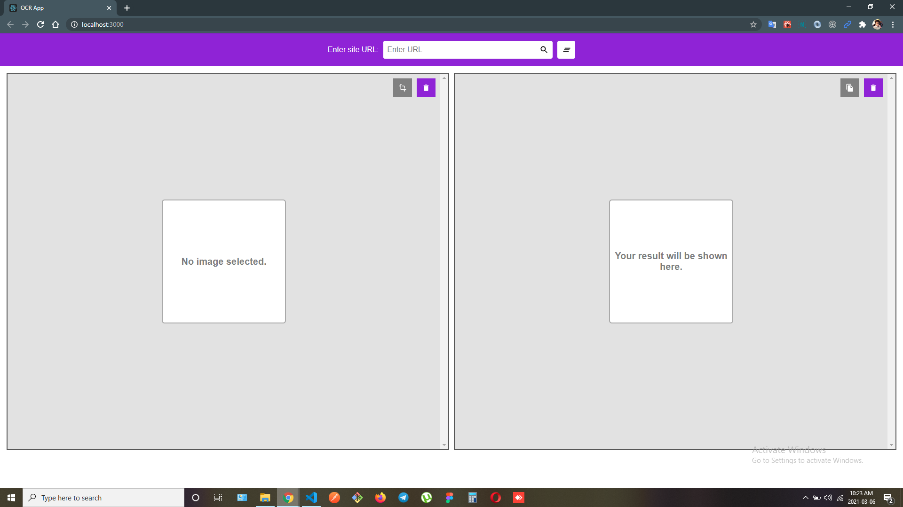
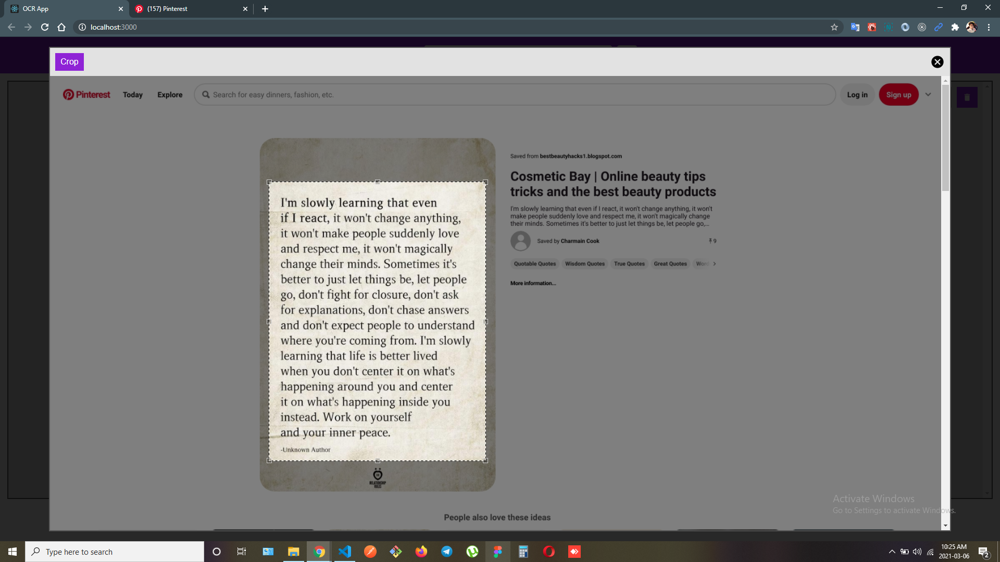
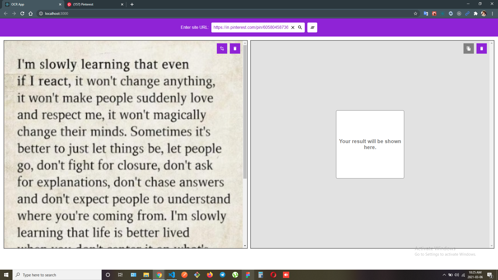
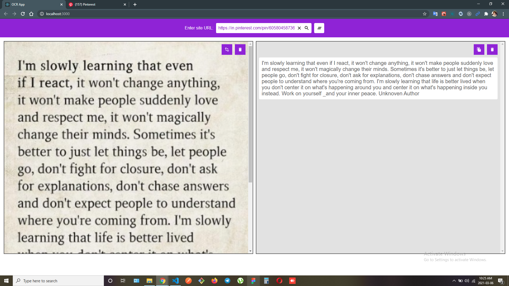

# OCR WEB APP

Hi! I'm Debjit, a **MERN Stack Developer**. This is a simple OCR (Optical Character Recognition) application **OCR Web App**. I have created it with **React** in frontend.
 
 
> ### Web App Link - https://ocr-app-2021.web.app/

 

## Features

- PAste URL of target website
- Crop section from the screenshot of the website
- Extract text from the cropped section
- Copy text

##  NPM Packages Used

- Material UI
- React Image Crop
- Firebase

## Screenshots

 

 

 

 
